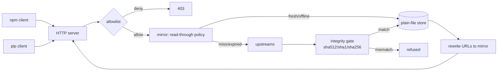

# depshelf

[English](README.md) | [中文](README.zh.md) | [日本語](README.ja.md)

[](LICENSE) [](go.mod) [](CHANGELOG.md)  [](CONTRIBUTING.md)

**depshelf：npm と PyPI のためのオープンソース・シングルバイナリ read-through ミラー — tarball ストアはただのファイル、完全オフライン運用が可能で、デフォルト拒否の許可リストを備え、エアギャップ環境や不安定なネットワークでの開発のために作られた。**


```bash
git clone https://github.com/JaydenCJ/depshelf && cd depshelf
go build -o depshelf ./cmd/depshelf    # single static binary, stdlib only
```

> プレリリース：v0.1.0 はまだどのパッケージレジストリにも公開されていません。上記の通りソースからビルドしてください（Go ≥1.22 で可）。

## なぜ depshelf？

どのチームもいずれ、`npm install` と `pip install` がネットワークイベントであることを思い知らされます。レジストリが不調になれば CI は落ち、エアギャップ環境では何もインストールできず、サプライチェーン騒動のたびに「許可するパッケージ集合を固定できる関門が欲しい」と誰かが言い出します。既存の答えは重量級かつ単一エコシステム — Verdaccio は npm しか話せない Node アプリ、devpi は PyPI しか話せない Python サーバで、多言語リポジトリは 2 つのサービス・2 種類の設定方言・2 つの不透明なストレージ DB を抱えることになります。depshelf は両プロトコルを同時に話す 1 つの静的 Go バイナリです。`/npm/` に npm registry 互換の面を、`/pypi/` に PEP 503 / PEP 691 の simple インデックスを備え、その背後は透明なプレーンファイルのディレクトリ 1 つ — エアギャップ側へ rsync でき、デバッグ時に grep でき、`sha256sum -c` で再検証できます。すべての成果物はメタデータが宣言したダイジェストに対して検証されてからディスクに載り、上流が落ちても stale なメタデータでインストールを守り、`--offline` は同じストアを完全ノーネットワークの保証に変えます。

| | depshelf | Verdaccio | devpi | ~/.npm + pip cache |
|---|---|---|---|---|
| npm プロトコル | ✅ | ✅ | ❌ | n/a |
| PyPI プロトコル（PEP 503 + 691） | ✅ | ❌ | ✅ | n/a |
| 単一の静的バイナリ | ✅ | ❌ Node アプリ | ❌ Python サーバ | 組み込み |
| ストアがプレーンファイルで rsync 可能 | ✅ | 一部（独自レイアウト + DB ファイル） | ❌ SQLite + レイアウト | 不透明 |
| 完全オフライン / エアギャップ対応 | ✅ `--offline` | 部分的 | 部分的 | ❌ ミスは失敗 |
| 許可リストの関門 | ✅ デフォルト拒否 | プラグイン/設定 | 設定 | ❌ |
| 取り込み時に全成果物をダイジェスト検証 | ✅ 不一致は拒否 | ❌ 上流を信頼 | 部分的 | ❌ |
| ランタイム依存 | 0 | 数百の npm パッケージ | 十数個の PyPI パッケージ | n/a |

<sub>依存数は 2026-07-13 に確認：depshelf は Go 標準ライブラリのみを import。verdaccio@6 は 300+ の npm パッケージを、devpi-server は 15+ の PyPI ディストリビューションをインストールする。</sub>

## 機能

- **2 つのレジストリを 1 バイナリで** — 同じポートの `/npm/` に `npm` を、`/pypi/simple/` に `pip` を向けるだけ。スコープ付きパッケージ、dist-tags、PEP 503 リダイレクト、PEP 691 コンテントネゴシエーションはすべて本物のレジストリと同じに振る舞う。
- **プレーンファイルのストア** — `packument.json`、`index.json`、tarball と wheel が文書化されたディレクトリツリー（[docs/store-layout.md](docs/store-layout.md)）に置かれ、`sha256sum -c` 互換のサイドカー付き。バックアップは `cp -r`、移送は `tar`。
- **誠実な完全性検証をデフォルトで** — すべてのダウンロードはアトミックな rename の前に、メタデータが宣言したダイジェスト（SRI sha512、レガシー sha1、PyPI sha256）と照合される。不一致のバイトは決してストアに入らず、`depshelf verify` でいつでも棚全体を再証明できる。
- **不安定なネットワークのための設計** — 不変の成果物は永久にキャッシュ。上流に届かないときはインストールを落とす代わりに stale なメタデータを提供（`X-Depshelf-Source: stale` を明示）。上流の 404 は権威として扱い、取り下げられたパッケージがキャッシュに居座ることはない。
- **エアギャップ・ネイティブ** — `--offline` は決してネットワークに触れず、`depshelf import` はローカルの `.tgz`/`.whl`/`.tar.gz` からストアを播種し、上流なしで正しい packument（integrity フィールド、semver を理解する `dist-tags.latest`）と PEP 691 インデックスを生成する。
- **サプライチェーンの関門** — 1 行 1 ルールの許可リスト（`npm:@myorg/*`、`pypi:requests`）でミラーはデフォルト拒否になり、リスト外はすべて 403、そもそも取得もされない。
- **依存ゼロ・テレメトリなし** — Go 標準ライブラリのみ。指定しない限り 127.0.0.1 にバインドし、設定した上流以外へは何も送らない。

## クイックスタート

```bash
./depshelf serve --store ./shelf     # read-through against npmjs.org + pypi.org
```

実際にキャプチャした出力：

```text
2026/07/13 11:01:06 depshelf 0.1.0 listening on http://127.0.0.1:8417 (store ./shelf, read-through mode)
2026/07/13 11:01:06 npm registry: http://127.0.0.1:8417/npm/ — pip index: http://127.0.0.1:8417/pypi/simple/
```

クライアントを向ける（プロジェクト単位でもグローバルでも）：

```bash
npm config set registry http://127.0.0.1:8417/npm
pip config set global.index-url http://127.0.0.1:8417/pypi/simple/
```

以後のインストールが棚を満たしていく。棚卸しと完全性の証明（実出力）：

```text
$ depshelf list --store ./shelf
ECOSYSTEM  PACKAGE   METADATA  ARTIFACTS  BYTES
npm        demo-lib  yes       1          187
pypi       demo-lib  yes       1          36
2 packages, 2 artifacts, 223 bytes

$ depshelf verify --store ./shelf
verified 2 artifacts: 2 ok, 0 corrupt, 0 unverified
```

ストアをエアギャップ側へ運び、ネットワーク完全遮断のまま提供する：

```bash
depshelf serve --store ./shelf --offline
```

## CLI リファレンス

`depshelf serve|import|list|verify|version` — 終了コード：0 成功、1 検証失敗、2 使い方エラー、3 実行時エラー。

| フラグ（serve） | デフォルト | 効果 |
|---|---|---|
| `--store` | `./depshelf-store` | ストアディレクトリ（プレーンファイル） |
| `--listen` | `127.0.0.1:8417` | 待ち受けアドレス。指定しない限りループバックのみ |
| `--offline` | オフ | ストアからのみ提供し、ネットワークに一切触れない |
| `--allowlist` | — | ルールファイル。指定した時点でデフォルト拒否（[例](examples/allowlist.example)） |
| `--npm-upstream` | `https://registry.npmjs.org` | read-through する npm レジストリ |
| `--pypi-upstream` | `https://pypi.org/simple` | read-through する PyPI simple インデックス |
| `--metadata-ttl` | `15m` | キャッシュ済みメタデータを新鮮とみなす期間 |
| `--public-url` | リクエストの Host | 書き換え後のダウンロードリンクに使う基底 URL |

`import npm|pypi <file>` は tarball 内の `package.json` から名前/バージョンを読む（PyPI プロジェクトは wheel/sdist のファイル名から推定）。`--name`/`--version` で上書き可能。棚のエンドポイント自体がプロトコル互換の上流なので、棚は連結できる：ある棚の `--npm-upstream`/`--pypi-upstream` を別の棚へ向ければよい（[examples/README.md](examples/README.md)）。

## 検証

このリポジトリは CI を同梱しない。上記の主張はすべてローカル実行で検証される：

```bash
go test ./...            # 88 deterministic tests, offline, < 5 s
bash scripts/smoke.sh    # end-to-end: seed, serve, chain, stale-fallback — prints SMOKE OK
```

## アーキテクチャ



## ロードマップ

- [x] v0.1.0 — npm + PEP 503/691 の read-through ミラーリング、サイドカー付きプレーンファイルストア、完全性ゲート、stale フォールバック、`--offline`、`import`/`list`/`verify`、許可リスト、88 テスト + スモークスクリプト
- [ ] 巨大な成果物のための Range リクエストとレジューム対応ダウンロード
- [ ] `depshelf prefetch` — ロックファイル（`package-lock.json`、`requirements.txt`）を解決して棚を一括で満たすコマンド
- [ ] ストアのガベージコレクション（`prune --keep-latest N`）
- [ ] チーム共有棚のためのオプションの TLS とベーシック認証
- [ ] 第三のエコシステムとして Cargo（sparse index）を追加

全リストは [open issues](https://github.com/JaydenCJ/depshelf/issues) を参照。

## コントリビュート

Issue・ディスカッション・PR を歓迎します — ローカルのワークフロー（フォーマット、vet、テスト、`SMOKE OK`）は [CONTRIBUTING.md](CONTRIBUTING.md) を参照。入門向けタスクは [good first issue](https://github.com/JaydenCJ/depshelf/issues?q=is%3Aissue+is%3Aopen+label%3A%22good+first+issue%22) のラベル付き、設計の議論は [Discussions](https://github.com/JaydenCJ/depshelf/discussions) で。

## ライセンス

[MIT](LICENSE)
