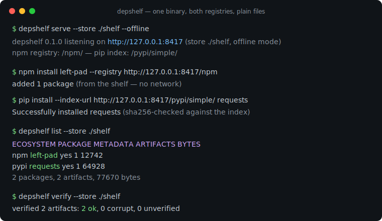
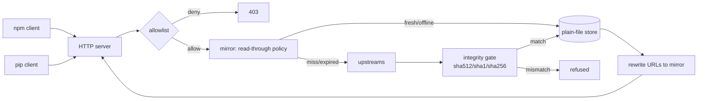

# depshelf

[English](README.md) | [中文](README.zh.md) | [日本語](README.ja.md)

[](LICENSE) [](go.mod) [](CHANGELOG.md)  [](CONTRIBUTING.md)

**depshelf：an open-source, single-binary read-through mirror for npm and PyPI — the tarball store is plain files, fully offline-capable, with a deny-by-default allowlist for airgapped and flaky-network development.**



```bash
git clone https://github.com/JaydenCJ/depshelf && cd depshelf
go build -o depshelf ./cmd/depshelf    # single static binary, stdlib only
```

> Pre-release: v0.1.0 is not tagged on a package registry yet; build from source as above (any Go ≥1.22).

## Why depshelf?

Every team eventually rediscovers that `npm install` and `pip install` are network events: CI dies when the registry hiccups, airgapped environments can't install anything, and after each supply-chain scare someone asks for a choke point where the allowed package set is pinned down. The established answers are heavyweight and single-ecosystem — Verdaccio is a Node application that speaks only npm, devpi is a Python server that speaks only PyPI, so a polyglot repo runs two services with two config dialects and two opaque storage databases. depshelf is one static Go binary that speaks both protocols at once: an npm-registry-compatible surface under `/npm/` and a PEP 503 / PEP 691 simple index under `/pypi/`, backed by one transparent directory of plain files you can rsync to the airgapped side, grep when debugging, and re-hash with `sha256sum -c`. Every artifact is integrity-verified against the digest its metadata advertised before it touches disk, stale metadata keeps installs working when the upstream is down, and `--offline` turns the same store into a hard no-network guarantee.

| | depshelf | Verdaccio | devpi | ~/.npm + pip cache |
|---|---|---|---|---|
| npm protocol | ✅ | ✅ | ❌ | n/a |
| PyPI protocol (PEP 503 + 691) | ✅ | ❌ | ✅ | n/a |
| Single static binary | ✅ | ❌ Node app | ❌ Python server | built-in |
| Store is plain files, rsync-able | ✅ | partly (own layout + DB files) | ❌ SQLite + layout | opaque |
| Serves fully offline / airgapped | ✅ `--offline` | partial | partial | ❌ misses fail |
| Allowlist choke point | ✅ deny-by-default | plugin/config | config | ❌ |
| Digest-verifies every artifact on ingest | ✅ refuses mismatches | ❌ trusts upstream | partial | ❌ |
| Runtime dependencies | 0 | hundreds of npm packages | dozens of PyPI packages | n/a |

<sub>Dependency counts checked 2026-07-13: depshelf imports the Go standard library only; verdaccio@6 installs 300+ npm packages; devpi-server pulls 15+ PyPI distributions.</sub>

## Features

- **Both registries, one binary** — point `npm` at `/npm/` and `pip` at `/pypi/simple/` on the same port; scoped packages, dist-tags, PEP 503 redirects and PEP 691 content negotiation all behave the way the real registries do.
- **Plain-file store** — `packument.json`, `index.json`, tarballs and wheels sit in a documented directory tree ([docs/store-layout.md](docs/store-layout.md)) with `sha256sum -c`-compatible sidecars; backup is `cp -r`, transfer is `tar`.
- **Honest integrity, on by default** — every download is checked against the digest its metadata advertised (SRI sha512, legacy sha1, or PyPI sha256) before the atomic rename; mismatched bytes never reach the store, and `depshelf verify` re-proves the whole shelf any time.
- **Built for flaky networks** — immutable artifacts are cached forever; when the upstream is unreachable, cached metadata is served stale (labelled `X-Depshelf-Source: stale`) instead of failing your install; upstream 404s stay authoritative so unpublished packages don't haunt the cache.
- **Airgap-native** — `--offline` never touches the network, and `depshelf import` seeds a store from local `.tgz`/`.whl`/`.tar.gz` files, generating correct packuments (integrity fields, semver-aware `dist-tags.latest`) and PEP 691 indexes without any upstream.
- **Supply-chain choke point** — a one-line-per-rule allowlist (`npm:@myorg/*`, `pypi:requests`) makes the mirror deny-by-default; everything else answers 403 and is never fetched.
- **Zero dependencies, no telemetry** — Go standard library only, binds 127.0.0.1 unless told otherwise, sends nothing anywhere except to the upstreams you configure.

## Quickstart

```bash
./depshelf serve --store ./shelf     # read-through against npmjs.org + pypi.org
```

Real captured output:

```text
2026/07/13 11:01:06 depshelf 0.1.0 listening on http://127.0.0.1:8417 (store ./shelf, read-through mode)
2026/07/13 11:01:06 npm registry: http://127.0.0.1:8417/npm/ — pip index: http://127.0.0.1:8417/pypi/simple/
```

Point your clients at it (per project or globally):

```bash
npm config set registry http://127.0.0.1:8417/npm
pip config set global.index-url http://127.0.0.1:8417/pypi/simple/
```

Installs now fill the shelf; take stock and prove integrity (real output):

```text
$ depshelf list --store ./shelf
ECOSYSTEM  PACKAGE   METADATA  ARTIFACTS  BYTES
npm        demo-lib  yes       1          187
pypi       demo-lib  yes       1          36
2 packages, 2 artifacts, 223 bytes

$ depshelf verify --store ./shelf
verified 2 artifacts: 2 ok, 0 corrupt, 0 unverified
```

Move the store to the airgapped side and serve it with the network hard-off:

```bash
depshelf serve --store ./shelf --offline
```

## CLI reference

`depshelf serve|import|list|verify|version` — exit codes: 0 ok, 1 verification failure, 2 usage error, 3 runtime error.

| Flag (serve) | Default | Effect |
|---|---|---|
| `--store` | `./depshelf-store` | store directory (plain files) |
| `--listen` | `127.0.0.1:8417` | listen address; loopback unless you say otherwise |
| `--offline` | off | serve only from the store; never touch the network |
| `--allowlist` | — | rules file; present = deny-by-default ([example](examples/allowlist.example)) |
| `--npm-upstream` | `https://registry.npmjs.org` | npm registry to read through |
| `--pypi-upstream` | `https://pypi.org/simple` | PyPI simple index to read through |
| `--metadata-ttl` | `15m` | how long cached metadata counts as fresh |
| `--public-url` | request Host | base URL written into rewritten download links |

`import npm|pypi <file>` reads name/version from the tarball's `package.json` (or infers the PyPI project from the wheel/sdist filename); `--name`/`--version` override. Because a shelf's endpoints are protocol-compatible upstreams, shelves chain: point one shelf's `--npm-upstream`/`--pypi-upstream` at another ([examples/README.md](examples/README.md)).

## Verification

This repository ships no CI; every claim above is verified by local runs:

```bash
go test ./...            # 88 deterministic tests, offline, < 5 s
bash scripts/smoke.sh    # end-to-end: seed, serve, chain, stale-fallback — prints SMOKE OK
```

## Architecture



## Roadmap

- [x] v0.1.0 — npm + PEP 503/691 read-through mirroring, plain-file store with sidecars, integrity gate, stale fallback, `--offline`, `import`/`list`/`verify`, allowlist, 88 tests + smoke script
- [ ] Range requests and resumable downloads for very large artifacts
- [ ] `depshelf prefetch` — resolve a lockfile (`package-lock.json`, `requirements.txt`) and fill the shelf in one command
- [ ] Store garbage collection (`prune --keep-latest N`)
- [ ] Optional TLS and basic-auth for shared team shelves
- [ ] Cargo (sparse index) as a third ecosystem

See the [open issues](https://github.com/JaydenCJ/depshelf/issues) for the full list.

## Contributing

Issues, discussions and pull requests are welcome — see [CONTRIBUTING.md](CONTRIBUTING.md) for the local workflow (format, vet, tests, `SMOKE OK`). Good entry points are labelled [good first issue](https://github.com/JaydenCJ/depshelf/issues?q=is%3Aissue+is%3Aopen+label%3A%22good+first+issue%22), and design questions live in [Discussions](https://github.com/JaydenCJ/depshelf/discussions).

## License

[MIT](LICENSE)
