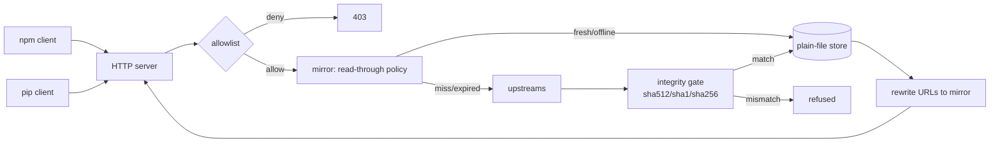

# depshelf

[English](README.md) | [中文](README.zh.md) | [日本語](README.ja.md)

[](LICENSE) [](go.mod) [](CHANGELOG.md)  [](CONTRIBUTING.md)

**depshelf：开源的单二进制 npm + PyPI 读穿透（read-through）镜像 —— tarball 仓库就是普通文件，完全可离线运行，自带默认拒绝的白名单，为隔离网络与不稳定网络下的开发而生。**


```bash
git clone https://github.com/JaydenCJ/depshelf && cd depshelf
go build -o depshelf ./cmd/depshelf    # single static binary, stdlib only
```

> 预发布提示：v0.1.0 尚未发布到任何包注册表；请按上述方式从源码构建（Go ≥1.22 均可）。

## 为什么选 depshelf？

每个团队迟早都会重新意识到 `npm install` 和 `pip install` 是网络事件：注册表一抖 CI 就挂，隔离网络环境什么都装不了，而每次供应链安全事件之后，总有人要求一个能把允许安装的包集合钉死的卡点。现有方案既笨重又只顾单一生态 —— Verdaccio 是只会说 npm 协议的 Node 应用，devpi 是只会说 PyPI 协议的 Python 服务，多语言仓库只好跑两个服务、维护两套配置方言和两个不透明的存储数据库。depshelf 是一个同时说两种协议的静态 Go 二进制：`/npm/` 下是 npm registry 兼容接口，`/pypi/` 下是 PEP 503 / PEP 691 simple 索引，背后是一个透明的普通文件目录 —— 可以 rsync 到隔离侧、调试时直接 grep、用 `sha256sum -c` 重新校验。每个制品在落盘前都会按其元数据宣告的摘要做完整性校验，上游宕机时用陈旧元数据保住安装，`--offline` 则把同一个仓库变成硬性的零网络保证。

| | depshelf | Verdaccio | devpi | ~/.npm + pip cache |
|---|---|---|---|---|
| npm 协议 | ✅ | ✅ | ❌ | n/a |
| PyPI 协议（PEP 503 + 691） | ✅ | ❌ | ✅ | n/a |
| 单个静态二进制 | ✅ | ❌ Node 应用 | ❌ Python 服务 | 内置 |
| 仓库是普通文件、可 rsync | ✅ | 部分（私有布局 + DB 文件） | ❌ SQLite + 布局 | 不透明 |
| 完全离线 / 隔离网络可用 | ✅ `--offline` | 部分 | 部分 | ❌ 未命中即失败 |
| 白名单卡点 | ✅ 默认拒绝 | 插件/配置 | 配置 | ❌ |
| 落盘前逐制品摘要校验 | ✅ 不符即拒绝 | ❌ 信任上游 | 部分 | ❌ |
| 运行时依赖 | 0 | 数百个 npm 包 | 十余个 PyPI 包 | n/a |

<sub>依赖数量核查于 2026-07-13：depshelf 只 import Go 标准库；verdaccio@6 会安装 300+ 个 npm 包；devpi-server 会拉取 15+ 个 PyPI 发行包。</sub>

## 功能特性

- **两个注册表，一个二进制** —— 把 `npm` 指向 `/npm/`、把 `pip` 指向同一端口的 `/pypi/simple/`；scoped 包、dist-tags、PEP 503 重定向和 PEP 691 内容协商都与真实注册表行为一致。
- **普通文件仓库** —— `packument.json`、`index.json`、tarball 和 wheel 就放在有文档说明的目录树里（[docs/store-layout.md](docs/store-layout.md)），配有兼容 `sha256sum -c` 的校验旁文件；备份就是 `cp -r`，转移就是 `tar`。
- **诚实的完整性校验，默认开启** —— 每次下载都在原子改名前按元数据宣告的摘要校验（SRI sha512、遗留 sha1 或 PyPI sha256）；不匹配的字节永远进不了仓库，`depshelf verify` 随时可重新证明整个货架。
- **为不稳定网络而造** —— 不可变制品永久缓存；上游不可达时改为提供陈旧元数据（标记 `X-Depshelf-Source: stale`）而不是让安装失败；上游 404 保持权威，已下架的包不会在缓存里阴魂不散。
- **隔离网络原生支持** —— `--offline` 绝不触网，`depshelf import` 用本地 `.tgz`/`.whl`/`.tar.gz` 文件播种仓库，无需任何上游即可生成正确的 packument（完整性字段、感知 semver 的 `dist-tags.latest`）和 PEP 691 索引。
- **供应链卡点** —— 一行一条规则的白名单（`npm:@myorg/*`、`pypi:requests`）让镜像默认拒绝；名单之外一律 403，且永远不会被抓取。
- **零依赖、零遥测** —— 只用 Go 标准库，不特别指定就只绑定 127.0.0.1，除了你配置的上游之外不向任何地方发送任何东西。

## 快速上手

```bash
./depshelf serve --store ./shelf     # read-through against npmjs.org + pypi.org
```

真实捕获的输出：

```text
2026/07/13 11:01:06 depshelf 0.1.0 listening on http://127.0.0.1:8417 (store ./shelf, read-through mode)
2026/07/13 11:01:06 npm registry: http://127.0.0.1:8417/npm/ — pip index: http://127.0.0.1:8417/pypi/simple/
```

把客户端指过来（按项目或全局均可）：

```bash
npm config set registry http://127.0.0.1:8417/npm
pip config set global.index-url http://127.0.0.1:8417/pypi/simple/
```

此后安装即自动上架；随时盘点并证明完整性（真实输出）：

```text
$ depshelf list --store ./shelf
ECOSYSTEM  PACKAGE   METADATA  ARTIFACTS  BYTES
npm        demo-lib  yes       1          187
pypi       demo-lib  yes       1          36
2 packages, 2 artifacts, 223 bytes

$ depshelf verify --store ./shelf
verified 2 artifacts: 2 ok, 0 corrupt, 0 unverified
```

把仓库搬到隔离侧，在网络硬关闭的状态下继续服务：

```bash
depshelf serve --store ./shelf --offline
```

## CLI 参考

`depshelf serve|import|list|verify|version` —— 退出码：0 成功，1 校验失败，2 用法错误，3 运行时错误。

| 参数（serve） | 默认值 | 作用 |
|---|---|---|
| `--store` | `./depshelf-store` | 仓库目录（普通文件） |
| `--listen` | `127.0.0.1:8417` | 监听地址；不特别指定就只在回环上 |
| `--offline` | 关 | 只从仓库提供服务；绝不触网 |
| `--allowlist` | — | 规则文件；一旦提供即默认拒绝（[示例](examples/allowlist.example)） |
| `--npm-upstream` | `https://registry.npmjs.org` | 读穿透的 npm 注册表 |
| `--pypi-upstream` | `https://pypi.org/simple` | 读穿透的 PyPI simple 索引 |
| `--metadata-ttl` | `15m` | 缓存元数据在多长时间内视为新鲜 |
| `--public-url` | 请求 Host | 写入改写后下载链接的基础 URL |

`import npm|pypi <file>` 会从 tarball 里的 `package.json` 读取名称/版本（PyPI 项目则从 wheel/sdist 文件名推断）；`--name`/`--version` 可覆盖。由于货架自身的端点就是协议兼容的上游，货架可以级联：把一个货架的 `--npm-upstream`/`--pypi-upstream` 指向另一个即可（[examples/README.md](examples/README.md)）。

## 验证

本仓库不附带任何 CI；上述每一条主张都由本地运行验证：

```bash
go test ./...            # 88 deterministic tests, offline, < 5 s
bash scripts/smoke.sh    # end-to-end: seed, serve, chain, stale-fallback — prints SMOKE OK
```

## 架构



## 路线图

- [x] v0.1.0 —— npm + PEP 503/691 读穿透镜像、带旁文件的普通文件仓库、完整性闸门、陈旧回退、`--offline`、`import`/`list`/`verify`、白名单、88 个测试 + 冒烟脚本
- [ ] 面向超大制品的 Range 请求与断点续传
- [ ] `depshelf prefetch` —— 解析锁文件（`package-lock.json`、`requirements.txt`）一条命令填满货架
- [ ] 仓库垃圾回收（`prune --keep-latest N`）
- [ ] 面向团队共享货架的可选 TLS 与基础认证
- [ ] 把 Cargo（sparse index）作为第三个生态接入

完整列表见 [open issues](https://github.com/JaydenCJ/depshelf/issues)。

## 参与贡献

欢迎 issue、讨论与 PR —— 本地工作流（格式化、vet、测试、`SMOKE OK`）见 [CONTRIBUTING.md](CONTRIBUTING.md)。入门任务标记为 [good first issue](https://github.com/JaydenCJ/depshelf/issues?q=is%3Aissue+is%3Aopen+label%3A%22good+first+issue%22)，设计讨论在 [Discussions](https://github.com/JaydenCJ/depshelf/discussions)。

## 许可证

[MIT](LICENSE)
